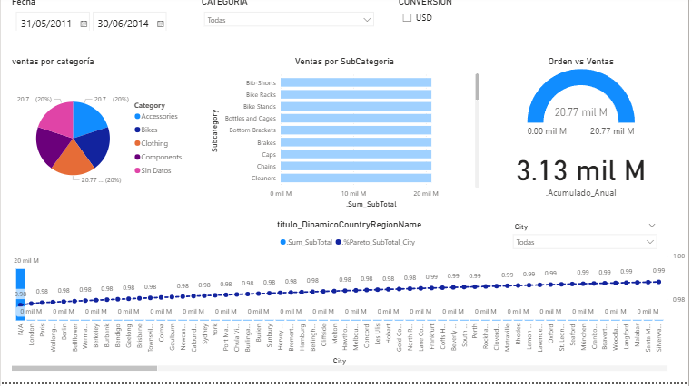
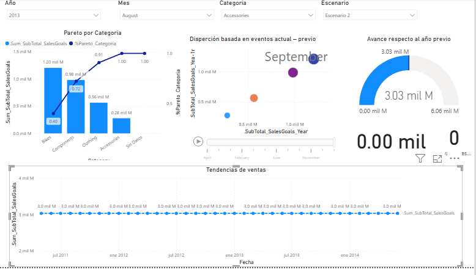

# proyectos-BI
# 📊 Dashboard de Ventas - Power BI

## Descripción

Este proyecto consiste en el desarrollo de un dashboard interactivo en Power BI para el análisis de ventas. El objetivo es transformar datos en información útil para apoyar la toma de decisiones mediante indicadores clave de desempeño (KPIs) y visualizaciones dinámicas.

## Objetivos

* Analizar el comportamiento de las ventas.
* Identificar los productos con mayor rendimiento.
* Evaluar el desempeño por categoría y período.
* Facilitar la toma de decisiones basada en datos.

## Tecnologías utilizadas

* Microsoft Power BI
* Power Query
* DAX
* SQL Server
* Modelo Estrella (Star Schema)

## Indicadores (KPIs)

* Total de Ventas
* Cantidad de Productos Vendidos
* Número de Clientes
* Ticket Promedio
* Variación de Ventas (%)
* Ventas por Categoría
* Ventas por Región
* Tendencia de Ventas Mensuales

## Visualizaciones

* Tarjetas de KPIs
* Gráfico de barras
* Gráfico de líneas
* Segmentadores (Slicers)
* Matriz de datos
* Mapa (si aplica)

## Estructura del modelo de datos

El modelo está basado en un esquema estrella, compuesto por:

**Tablas de dimensiones**

* DimFecha
* DimProducto
* DimCliente
* DimTerritorio
* DimEmpleado

**Tabla de hechos**

* FactSales

## Capturas del Dashboard

##ventas

##kpis

## Aprendizajes

Durante el desarrollo de este proyecto se aplicaron conocimientos de:

* Modelado dimensional.
* Creación de medidas DAX.
* Transformación de datos con Power Query.
* Diseño de dashboards interactivos.
* Análisis de indicadores de negocio.

## Autor

**María**

Analista de Sistemas | Data Analyst | Analista Programador

LinkedIn: www.linkedin.com/in/maria-isabel-calagua-egusquiza

