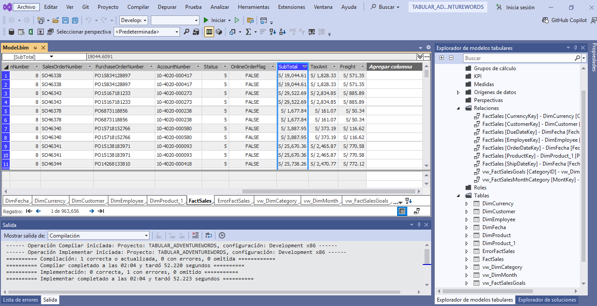

# proyectos-BI
# 📊 BI Projects - Analysis Services

## Descripción

Proyecto de Business Intelligence desarrollado con tecnologías Microsoft BI, integrando un modelo de datos dimensional, procesos ETL, Analysis Services Tabular y Power BI para el análisis y visualización de indicadores empresariales.

## Arquitectura de la solución

Flujo de datos:

SQL Server  
⬇️  
Proceso ETL  
⬇️  
Data Warehouse (Modelo Estrella)  
⬇️  
Analysis Services Tabular  
⬇️  
Power BI Dashboard

## Objetivos

* Analizar el comportamiento de las ventas.
* Identificar los productos con mayor rendimiento.
* Evaluar el desempeño por categoría y período.
* Facilitar la toma de decisiones basada en datos.

## Tecnologías utilizadas

- SQL Server
- Data Warehouse
- Analysis Services Tabular (SSAS)
- Power BI
- DAX
- Power Query
- Visual Studio
- GitHub

## Componentes del proyecto

### 🗄️ Data Warehouse

- Diseño de modelo dimensional.
- Tablas de hechos y dimensiones.
- Carga de información mediante procedimientos almacenados.
- Transformación y limpieza de datos.

### 📈 Analysis Services Tabular

Implementación de un modelo semántico para análisis:

- Creación de relaciones entre dimensiones y hechos.
- Medidas DAX.
- KPIs.
- Cálculos de indicadores.
- Optimización del modelo.

 ### 📊 Power BI

Dashboard interactivo con:

- Indicadores de ventas.
- Análisis por producto.
- Análisis temporal.
- Segmentación de información.
- Visualización de KPIs.
- 
## Indicadores (KPIs)

* Total de Ventas
* Cantidad de Productos Vendidos
* Número de Clientes
* Ticket Promedio
* Variación de Ventas (%)
* Ventas por Categoría
* Ventas por Región
* Tendencia de Ventas Mensuales

## Visualizaciones

* Tarjetas de KPIs
* Gráfico de barras
* Gráfico de líneas
* Segmentadores (Slicers)
* Matriz de datos
* Mapa (si aplica)

## Capturas del Dashboard

##Modelo tabular

##ventas

##kpis

## Aprendizajes

Durante el desarrollo de este proyecto se aplicaron conocimientos de:

* Modelado dimensional.
* Creación de medidas DAX.
* Transformación de datos con Power Query.
* Diseño de dashboards interactivos.
* Análisis de indicadores de negocio.

## Autor

**María**

Analista de Sistemas | Data Analyst | Analista Programador | Power BI | Tableau

LinkedIn: www.linkedin.com/in/maria-isabel-calagua-egusquiza

